<h1> MS Tech Camp #7  
Custom Vision Serviceで画像分類AIを作ろう！</h1>

[MS Tech Camp #7](https://mspjp.connpass.com/event/) で使用するハンズオン資料です。

Custom Vision Service で画像分類モデルを構築し、 APIを用いて送信した画像の分類結果を受け取ります。

## 1. Custom Vision Service プロジェクトを作成する

1-1 ブラウザで [Custom Vision Service ポータル](https://www.customvision.ai/) を開きます。 その後、[サインイン] を選択します。

1-2 サインインを求められたら、Microsoft アカウントの資格証明を使用してサインインします。 このアプリにユーザー情報へのアクセスを許可するように求められたら、[はい] をクリックし、プロンプトが表示されたらサービス使用条件に同意します。

1-3 [新しいプロジェクト] をクリックして、新しいプロジェクトを作成します。

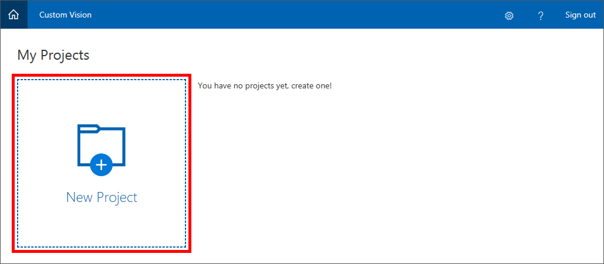

1-4 [新しいプロジェクトの作成] ダイアログで、プロジェクトに "Artworks" という名前を付けます。

1-5 このプロジェクトに使用する リソース グループ を選択します。 リソース グループをまだ用意していない場合は、[新規作成] を選択して新しいリソース グループを作成します。

1-6 必要事項を記入します。以下の表を参照してください。

|項目|記入・設定例|
|--|--|
|Project Types|Classification|
|Classification Types|Multilabel|
|Domain|General|

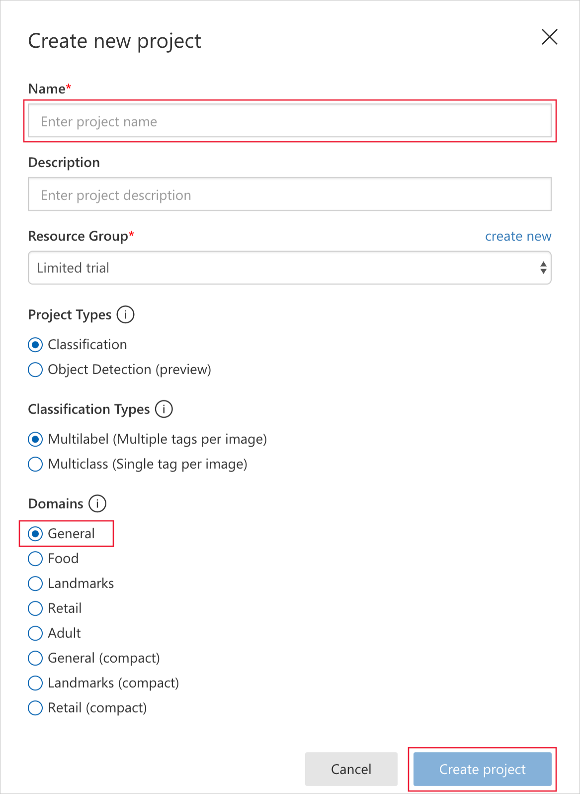

## 2. タグを付けた画像をアップロードする

今回のハンズオンでは、ピカソ、ポロック、レンブラントの有名な絵画の画像を Artworks プロジェクトに追加します。 Custom Vision Service がある画家を別の画家から区別することを学習できるように、画像にタグを付けます。

2-1 作成した Artworks プロジェクトで、サイド パネルの [タグ] の右側にあるプラス記号 [+] を選択します。

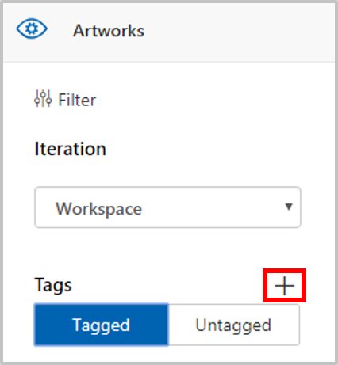

2-2 [Create a new tag](新しいタグの作成) というダイアログ ボックスが表示されます。 タグ名フィールドに「絵画」と入力して、[保存] を選択します。 この操作により、タグ リストに "絵画" タグが作成されます。 さらに追加しましょう。

2-3 手順 1 と 2 を繰り返し、値が ピカソ、ポロック、レンブラント のタグを追加します。 完了すると、タグ リストは次のようになります。

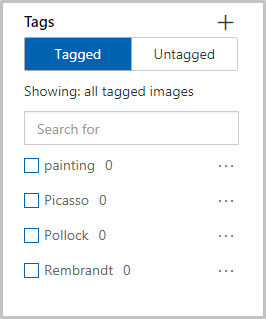

プロジェクト内の画像のうちこれらの各タグでタグ付けされたものの数はまだ 0 になっています。 プロジェクトに画像をいくつか追加してタグを割り当てましょう。

2-4 ハンズオンの画像リソースが格納されている [cvs resources.zip](https://github.com/MicrosoftDocs/mslearn-classify-images-with-the-custom-vision-service/raw/master/cvs-resources.zip) をダウンロードし、ローカル コンピューターに解凍します。

2-5 ポータルに戻り、[Add images](画像の追加) を選択して、プロジェクトに画像を追加します。

2-6 手順 4 でローカルにダウンロードした cvs-resources フォルダーで、"Artists\Picasso" フォルダーに移動します。

2-7 "Artists\Picasso" 内のすべてのファイルを選択し、[開く] を選択します。

2-8 [Image upload](画像のアップロード) ダイアログが開き、アップロードしたすべての画像のサムネイルが表示されます。 [My Tags](マイ タグ) フィールドを選択すると、これらの画像を割り当てることができるタグのドロップダウンが開きます。

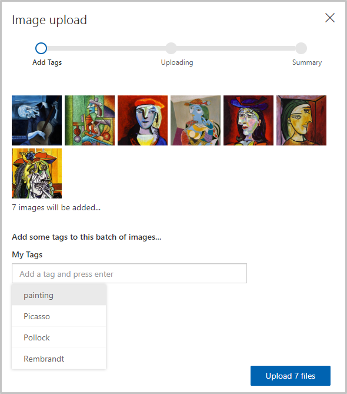

2-9 "絵画" タグと "ピカソ" タグを選択し、[Upload 7 files](7 個のファイルをアップロード) を選択してアップロードを終了します。

2-10 アップロードした画像が Artworks プロジェクトに含まれること、およびタグ リストが更新されて "ピカソ" と "絵画" タグが 7 個の画像に付けられたことが示されていることを確認します。

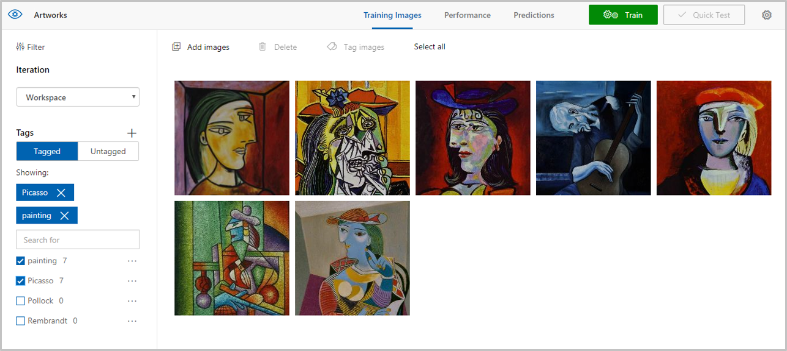

2-11 [Add images](画像の追加) を選択して、モジュール リソースの "Artists\Rembrandt" フォルダーにあるすべての画像を選択します。 それらに "絵画" と "レンブラント" というタグを付け、[Upload 6 files](6 個のファイルをアップロード) を選択してプロジェクトにアップロードします。

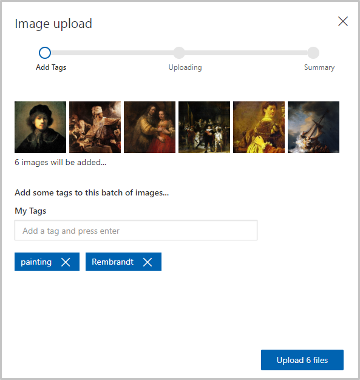

2-12 プロジェクトにピカソの画像と共にレンブラントの画像が表示され、タグの一覧に "レンブラント" と表示されることを確認します。

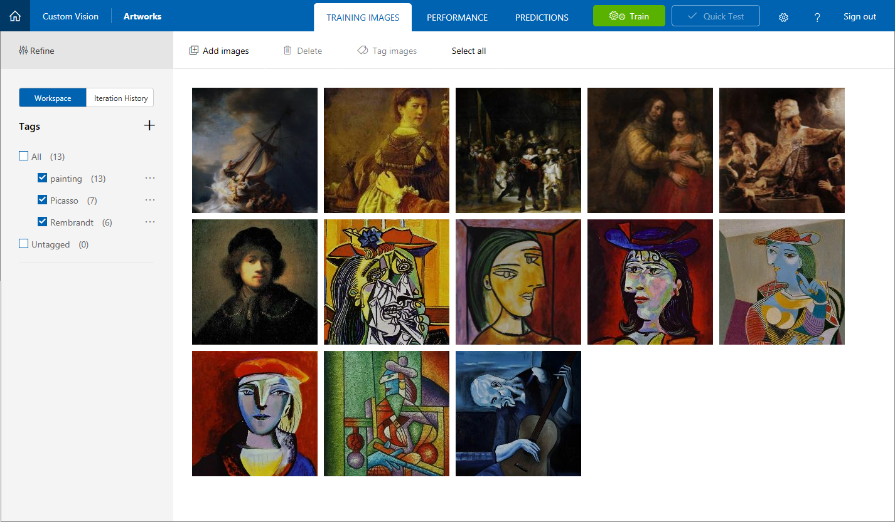

2-13 同じような方法で、ジャクソン ポロックの絵画を追加し、Custom Vision Service でポロックの絵画も認識できるようにします。 モジュール リソースの "Artists\Pollock" フォルダーですべての画像を選択し、"絵画" と "ポロック" というタグを付けて、プロジェクトにアップロードします。

## 3. モデルを訓練する

3-1 モデルをトレーニングするには、ページの上部にある [トレーニング] を選択します。 モデルをトレーニングするたびに、新しいイテレーションが作成されます。 Custom Vision Service には、進捗を時間を追って比較できるいくつかのイテレーションが保持されます。

3-2 トレーニング プロセスが終わるまで待機します。次に、イテレーション 1 に対して示されるトレーニング統計を確認します。

結果では、モデルの精度のメジャーとして 精度 と 再現率 の 2 つが示されます。 モデルにピカソの画像 3 つとレンブラントの画像 3 つを渡したとします。 ピカソのサンプルのうち 2 つは "ピカソ" の画像として正しく識別されましたが、レンブラントのサンプルのうち 2 つはピカソとして誤って識別されたとします。 この場合、4 つの画像のうち 2 つが正しく識別されたため、精度 は 50% になります。 ピカソの 3 つの画像のうち 2 つが正しく識別されたため、再現率 のスコアは 67% になります。

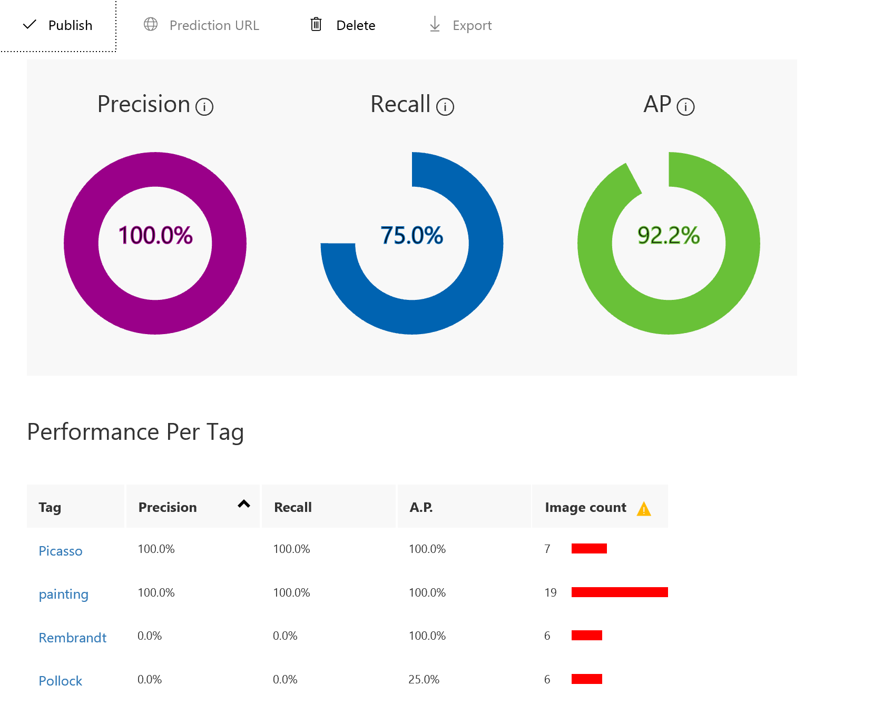

## 4. モデルをテストする

モデルのトレーニングが済んだので、今度はこれをテストします。 モデルに新しい画像を渡して、どれくらい正しく分類されるか確認します。

4-1 ページの上部にある [Quick Test](クイック テスト) を選択します。

4-2 [ローカル ファイルを参照します] を選択してから、前にダウンロードしたモジュール リソース フォルダー内の "Quick Tests" フォルダーを参照します。 PicassoTest_01.jpg、[開く] の順に選択します。

4-3 [Quick Test](クイック テスト) ダイアログでテストの結果を確認します。 絵画がピカソである確率はどれくらいですか。 レンブラントやポロックである確率はどれくらいですか。

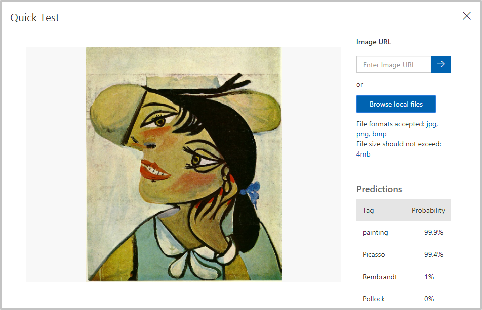

4-4 [Quick Test](クイック テスト) ダイアログを閉じます。 次に、ページの上部にある [予測] を選択します。

4-5 アップロードしたテスト画像を選択して、その詳細を表示します。 次に、ドロップダウンから [ピカソ] を選んで画像に "ピカソ" のタグを付け、[保存して閉じる] を選択します。

このようにテスト イメージをタグ付けすることによって、追加のトレーニング用イメージをアップロードすることなく、モデルを改良することができます。

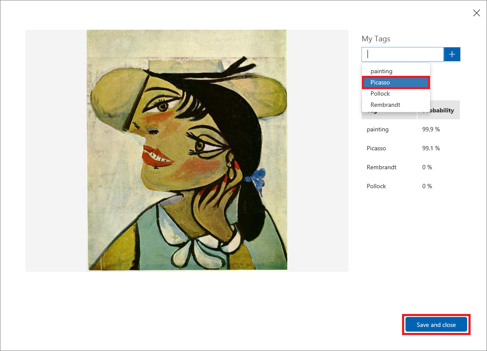

4-6 別のクイック テストを実行し、今度は [Quick Test](クイック テスト) フォルダー内の FlowersTest.jpg という名前のファイルを使用します。 この画像にはピカソ、レンブラント、またはポロックである確率として低い値が割り当てられることを確認します。

## 5. モデルのAPIを呼び出す

このモデルは使用する準備ができており、特定の画家ごとに絵画をうまく識別することができます。 次にHTTP 経由でAPIを呼び出して、識別結果を取得してみましょう。

5-1
